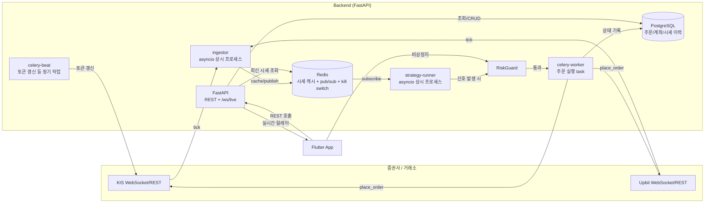

# QuantPilot 아키텍처

시장을 실시간 감시하고 설정한 전략에 따라 자동으로 매매를 실행하는 개인용 자산 관리 앱.

## 1. 전제 조건

- 단일 사용자 프로젝트 (다중 테넌트 SaaS 아님) — 인증은 앱 접근 제어 수준으로 단순화
- 1차 연동 브로커: 한국투자증권 KIS Developers (국내 주식, REST + WebSocket)
- 2차 연동 예정: Upbit (코인, REST + 공개 WebSocket) — 이를 위해 브로커 계층을 자산군 공용 인터페이스로 설계
- Task Queue: Celery + Redis
- 배포: 로컬 Docker Compose (클라우드 배포는 이후 단계)

## 2. 시스템 구성도



## 3. 프로세스 분리 이유

| 프로세스 | 특성 | Celery로 하지 않는 이유 |
|---|---|---|
| `ingestor` | 장시간 유지되는 WebSocket 연결 | Celery task는 짧은 실행 단위에 최적화, 상시 연결에는 부적합 |
| `strategy-runner` | Redis pub/sub을 구독하는 반응형 루프 | 동일하게 상시 실행이 필요, 폴링 대신 이벤트 기반으로 지연 최소화 |
| `celery-worker` | 주문 제출/취소 — 부수효과 + 재시도/멱등성 필요 | Celery의 재시도·큐잉이 정확히 이 용도에 맞음 |
| `celery-beat` | KIS 토큰 갱신, 정산 등 정기 작업 | 스케줄링이 핵심 요구사항 |

`docker-compose.yml`에 다섯 개 서비스(api, ingestor, strategy-runner, celery-worker, celery-beat) + postgres + redis로 정의되어 있다.

## 4. 데이터 흐름

1. **시세 수집**: `ingestor`가 KIS/Upbit WebSocket을 구독해 틱을 수신 → `market_data/cache.py`를 통해 Redis에 `price:{asset_class}:{symbol}` 키로 캐싱하고 동일 채널에 publish
2. **전략 평가**: `strategy-runner`가 Redis pub/sub을 구독 → 틱이 들어올 때마다 해당 심볼을 감시하는 활성 전략만 `strategy/engine.py`로 평가 (이동평균 교차, 가격 임계값 등 규칙 기반)
3. **리스크 체크**: 신호가 발생하면 주문 제출 전 반드시 `risk/guard.py`의 `RiskGuard`를 통과 — kill switch 확인, 포지션 한도, 손절 조건 체크
4. **주문 실행**: 통과한 신호는 `trading/tasks.py`의 Celery task로 위임 → `broker/factory.py`가 `TRADING_MODE`(paper/live)에 따라 KIS 또는 Upbit 어댑터를 선택해 실제 주문 API 호출 → 결과를 `orders` 테이블에 기록
5. **클라이언트 갱신**: FastAPI가 `/ws/live`로 시세/주문 상태 변경을 Flutter 앱에 릴레이 (KIS/Upbit WebSocket과는 별개의, 백엔드가 팬아웃하는 채널)
6. **이력 저장**: 체결 이력과 시세 캔들은 PostgreSQL에 저장 — 추후 백테스트/분석에 재사용 (대용량화 시 TimescaleDB 확장 도입 권장)

## 5. 안전장치 설계

- **모의/실전 분리**: `TRADING_MODE` 환경변수(paper/live)가 유일한 스위치이며 `broker/factory.py` 한 곳에서만 분기한다. KIS는 모의투자 전용 서버·자격증명이 별도로 존재하고, Upbit은 모의투자 서버가 없어 `paper` 모드에서는 실제 API를 호출하지 않고 리스크 가드의 시뮬레이션 체결 경로를 사용하도록 강제한다 (`broker/upbit/client.py`의 `_require_live`).
- **비상 정지(kill switch)**: Redis의 `kill_switch:global` 키 하나로 전체 신규 주문을 즉시 차단. 앱 대시보드에 상시 노출되는 버튼 → `POST /risk/kill-switch/engage` → 이후 모든 주문 경로(`RiskGuard.assert_can_trade`)가 이 값을 먼저 확인한다.
- **손절/포지션 한도**: 전략별 `stop_loss_pct`, `max_position_size`를 `RiskGuard.check_stop_loss` / `check_position_size`에서 체크, 초과 시 `RiskLimitExceededError`로 주문을 거부하고 감사 로그를 남긴다.
- **멱등성**: 모든 주문은 `client_order_id`를 미리 발급해 Celery task 재시도 시 중복 주문을 방지한다 (`OrderRequest.client_order_id`, `Order.client_order_id` unique 제약).
- **자격증명 분리**: `.env`에서 paper/live 앱키·시크릿을 완전히 분리된 변수로 관리해, live 자격증명이 실수로 paper 경로에 쓰이는 것을 원천 차단한다.

## 6. 폴더 구조 요약

```
QuantPilot/
├── ARCHITECTURE.md
├── docker-compose.yml
├── .env.example
├── backend/                        # FastAPI, Package by Feature
│   ├── app/
│   │   ├── core/                   # config, security(JWT), logging, exceptions
│   │   ├── db/                     # SQLAlchemy base/session, Redis client
│   │   ├── ws/                     # Flutter 앱으로의 실시간 릴레이(WS)
│   │   └── features/
│   │       ├── account/            # 로그인/JWT (단일 사용자 기준 최소 구현)
│   │       ├── broker/             # 자산군 공용 어댑터 인터페이스 + kis/, upbit/
│   │       ├── market_data/        # 시세 캐싱(Redis), ingestor(상시 프로세스), 이력(Postgres)
│   │       ├── strategy/           # 전략 CRUD, 평가 엔진, runner(상시 프로세스)
│   │       ├── trading/            # 주문 모델, Celery task, 이력 조회
│   │       ├── risk/               # kill switch, 손절/포지션 한도 가드
│   │       └── notification/       # 이벤트 알림(현재 앱 WS 채널만 구현)
│   ├── alembic/                    # DB 마이그레이션
│   └── tests/
└── frontend/                       # Flutter
    └── lib/
        ├── core/                   # network(Dio/WS 클라이언트), theme, di(Riverpod), constants
        └── features/               # dashboard, market_watch, strategy, orders, account, settings
            └── {feature}/{data,domain,presentation}/
```

## 7. 다음 단계 후보

- KIS/Upbit 실제 REST·WS 연동 구현 (`TODO`로 표시된 자리들)
- 전략 엔진 규칙 타입 확장 (RSI, 볼린저밴드 등) 및 백테스트 모듈
- 알림 채널 확장 (푸시 알림, 이메일)
- 시계열 데이터 규모가 커지면 TimescaleDB 도입 검토
- 배포 자동화(CI/CD), 클라우드 인프라 구성
